# Sơ Đồ Hoạt Động Nghiệp Vụ Ứng Dụng Theo Dõi Sức Khỏe

```mermaid
flowchart LR
    BD((Bắt đầu))
    KT((Kết thúc))

    subgraph KH["Khách / Người dùng"]
        direction TB
        KH1[Xem màn hình đăng nhập / đăng ký]
        KH2{Đã có tài khoản?}
        KH3[Đăng ký tài khoản]
        KH4[Đăng nhập]
        KH5{Đăng nhập thành công?}
        KH6[Quên mật khẩu / nhập lại thông tin]
        KH7[Cập nhật hồ sơ và onboarding]
        KH8[Ghi nhận dữ liệu hằng ngày]
        KH9[Chọn chức năng theo dõi]
        KH10[Xem dashboard, biểu đồ và lịch sử]
        KH11[Chat với trợ lý AI]
        KH12[Đọc thông báo / nhắc nhở]
    end

    subgraph HT["Hệ thống API Laravel"]
        direction TB
        HT1[Kiểm tra email và mật khẩu]
        HT2[Tạo tài khoản]
        HT3[Tạo hồ sơ người dùng mặc định]
        HT4[Lưu hồ sơ sức khỏe, chỉ số, mục tiêu]
        HT5[Lưu bữa ăn và chi tiết món ăn]
        HT6[Lưu lượng nước uống]
        HT7[Lưu hoạt động luyện tập]
        HT8[Lưu lịch dùng thuốc]
        HT9[Cập nhật tổng hợp sức khỏe hằng ngày]
        HT10[Tính BMI, calo vào, calo ra, nước uống]
        HT11[Tạo dữ liệu dashboard]
        HT12[Lưu lịch sử chat]
        HT13[Ghi nhận và đánh dấu thông báo]
    end

    subgraph AI["AI / Dịch vụ phân tích"]
        direction TB
        AI1[Thu thập ngữ cảnh sức khỏe]
        AI2[Tính điểm sức khỏe]
        AI3[Phân tích rủi ro và tình trạng]
        AI4[Tạo gợi ý dinh dưỡng]
        AI5[Tạo gợi ý luyện tập]
        AI6[Phản hồi câu hỏi chat]
        AI7[Lưu kết quả phân tích AI]
    end

    subgraph AD["Quản trị viên"]
        direction TB
        AD1[Đăng nhập trang quản trị]
        AD2[Xem thống kê hệ thống]
        AD3[Quản lý tài khoản người dùng]
        AD4[Khóa / mở khóa / đặt lại mật khẩu]
        AD5[Quản lý danh mục thực phẩm]
        AD6[Quản lý danh mục thuốc]
        AD7[Tạo và quản lý thông báo]
    end

    BD --> KH1 --> KH2
    KH2 -- Chưa có --> KH3 --> HT2 --> HT3 --> KH7
    KH2 -- Đã có --> KH4 --> HT1 --> KH5
    KH5 -- Không --> KH6 --> KH4
    KH5 -- Có --> KH7

    KH7 --> HT4 --> AI1 --> AI2 --> AI3 --> AI7
    AI7 --> KH8 --> KH9

    KH9 -->|Ăn uống| HT5
    KH9 -->|Nước uống| HT6
    KH9 -->|Vận động| HT7
    KH9 -->|Thuốc| HT8

    HT5 --> HT9
    HT6 --> HT9
    HT7 --> HT9
    HT8 --> HT9
    HT9 --> HT10 --> AI1

    AI2 --> AI4 --> HT11
    AI2 --> AI5 --> HT11
    HT10 --> HT11 --> KH10

    KH11 --> HT12 --> AI6 --> HT12 --> KH11
    KH12 --> HT13 --> KH10

    AD1 --> AD2
    AD2 --> AD3 --> AD4
    AD2 --> AD5
    AD2 --> AD6
    AD2 --> AD7 --> HT13

    KH10 --> KT
    AD4 --> KT
    AD5 --> KT
    AD6 --> KT

    classDef startEnd fill:#ffffff,stroke:#555,stroke-width:1.5px,color:#111;
    classDef user fill:#eaf3ff,stroke:#6b94c9,color:#111;
    classDef system fill:#fff2c4,stroke:#c8a846,color:#111;
    classDef ai fill:#e7f6df,stroke:#76aa63,color:#111;
    classDef admin fill:#f7ddeb,stroke:#c36a9b,color:#111;
    classDef decision fill:#ffffff,stroke:#666,stroke-width:1.5px,color:#111;

    class BD,KT startEnd;
    class KH1,KH3,KH4,KH6,KH7,KH8,KH9,KH10,KH11,KH12 user;
    class KH2,KH5 decision;
    class HT1,HT2,HT3,HT4,HT5,HT6,HT7,HT8,HT9,HT10,HT11,HT12,HT13 system;
    class AI1,AI2,AI3,AI4,AI5,AI6,AI7 ai;
    class AD1,AD2,AD3,AD4,AD5,AD6,AD7 admin;
```

## Tóm tắt luồng nghiệp vụ

- Người dùng bắt đầu bằng đăng ký hoặc đăng nhập. Nếu đăng ký mới, hệ thống tạo tài khoản và hồ sơ mặc định.
- Sau khi đăng nhập, người dùng cập nhật onboarding gồm hồ sơ cá nhân, chỉ số sức khỏe, mục tiêu và sở thích.
- Người dùng ghi nhận dữ liệu hằng ngày: bữa ăn, nước uống, vận động và lịch dùng thuốc.
- Hệ thống lưu dữ liệu, làm mới tổng hợp hằng ngày, tính BMI, calo, lượng nước, điểm sức khỏe và chuẩn bị dashboard.
- Dịch vụ AI/rule-based phân tích ngữ cảnh sức khỏe, tạo nhận xét, gợi ý dinh dưỡng, gợi ý luyện tập và phản hồi chat.
- Quản trị viên theo dõi thống kê, quản lý tài khoản, thực phẩm, thuốc và thông báo hệ thống.
